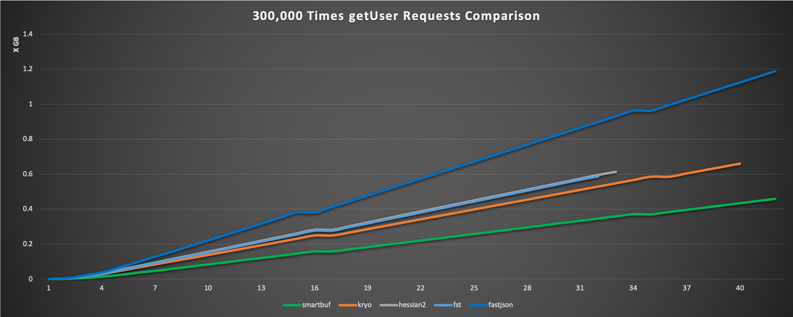
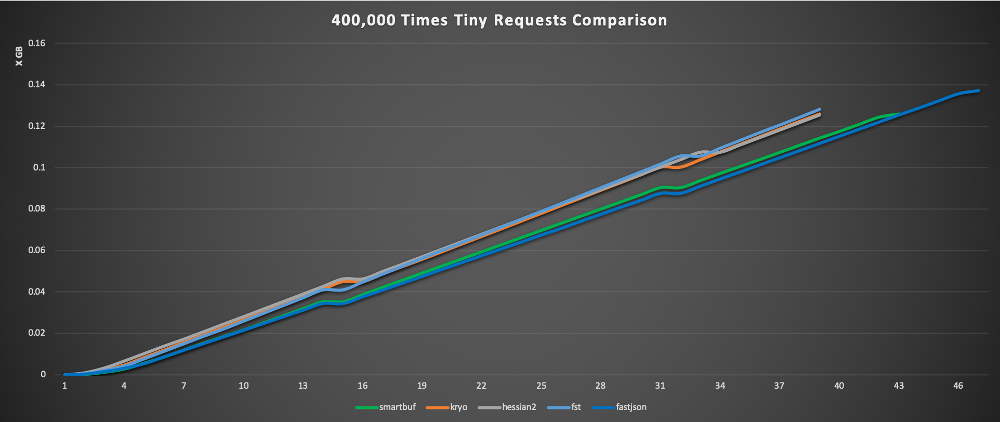

# smartbuf-dubbo [](https://travis-ci.org/smartbuf/smartbuf-dubbo)

*NOTICE: if you need EN version of this documentation, tell me please*

`smartbuf-dubbo`是一个基于`smartbuf`的`dubbo`序列化插件。

它内部封装了[`smartbuf`](https://github.com/smartbuf/smartbuf-java)序列化框架的`stream`模式，
通过自定义的`SmartbufSerialization`向`dubbo`暴露了一个名为`smartbuf`的序列化器。

# 关于`smartbuf`

`smartbuf`是一种新颖、高效、智能、易用的跨语言序列化框架，它既拥有不亚于`protobuf`的高性能，
也拥有与`json`相仿的通用性、可扩展性、可调试性等。

它内部采用分区序列化将松散的对象序列化为若干个紧凑的分区，从而大幅提高编码效率，
具体细节请参考[`smartbuf`项目](https://github.com/smartbuf/smartbuf-java/blob/master/doc/index_zh.md)。

# 使用方式

`smartbuf-dubbo`内部实现非常简单，它只是简单地按照[`dubbo`官方文档](https://dubbo.apache.org/zh-cn/docs/dev/impls/serialize.html)提供了序列化插件，包括三个`class`:

 + `SmartbufObjectInput`
 + `SmartbufObjectOutput`
 + `SmartbufSerialization`

以及位于`core/src/main/resources/META-INF.dubbo/`的插件配置。

此插件已打包`deploy`至中心仓库，所以你可以直接通过以下`maven`坐标引入它：

```xml
<dependency>
    <groupId>com.github.smartbuf</groupId>
    <artifactId>smartbuf-dubbo</artifactId>
    <version>1.0.1</version>
</dependency>
```

当然也可以直接将以上提到的`class`和`resources`配置复制入自己的工程中，同时记得手动添加`smartbuf`依赖。

之后就可以按照官方文档的配置，在`protocol`中选择启用序列化插件，具体效果可能类似于：

```xml
<dubbo:protocol serialization="smartbuf" />
```

此插件支持`com.alibaba`版本与`org.apache`版本的`dubbo`。

# 对比其他序列化方案  

根目录中的`demo-alibaba`和`demo-apache`分别针对`2.6.*`版本和`2.7.*`版本的`dubbo`进行序列化测试，
测试对象包括`smartbuf`、`fastjson`、`hessian2`、`kryo`、`fst`。

对比测试包括三部分：`tiny`、`user`、`posts`，分别对比测试各个序列化框架在**简单**、**普通**、**复杂**业务中的综合表现。

*提示：对比测试侧重于单线程的序列化性能、数据压缩率，最终数据仅用于横向对比各个序列化框架，并不能体现`dubbo`本身的多并发性能。*

## 大数据集`posts`测试

此测试中`dubbo`接口返回的数据为`100`个固定的`PostModel`实例，其具体模型如下：

```java
public class PostModel implements Serializable {
    private int         postId;
    private int         authorId;
    private Integer     prePostId;
    private String      title;
    private String      description;
    private ContentType contentType;
    private Visibility  visibility;
    private long        createTime;

    private List<Integer>    mentions = new ArrayList<>();
    private List<TopicModel> topics   = new ArrayList<>();
}
```

测试中随机创建`100`个`PostModel`对象、`10`个`TopicModel`对象，
然后随机为每个`PostModel`分配若干个`TopicModel`，最终模拟类似实际产品应用中的`queryPost`结果集。

这个数据集采用`json`编码时，大概`20KB`，各个序列化框架调用`10w`次的综合表现为：
 + **`fastjson`**: 耗时约`192s`, 网络输入输出总计约`17.88GB`
 + **`fst`**: 耗时约`52s`, 网络输入输出总计约`4.01GB`
 + **`hessian2`**: 耗时约`115s`, 网络输入输出总计约`11.08GB`
 + **`kryo`**: 耗时约`135s`, 网络输入输出总计约`4.05GB`
 + **`smartbuf`**: 耗时约`75s`, 网络输入输出总计约`2.15GB`

具体表现如下图所示，横轴表示时间，纵轴表示网络流量：


**说明**：模型中存在枚举值`ContentType`与`Visibility`，而测试中使用的`kryo`并不支持枚举，因此在测试`kryo`时直接忽略了枚举，最终导致它的测试数据并不完整。

## 普通数据集`user`测试

此测试中`dubbo`接口返回的数据为`1`个固定的`UserModel`实例，其具体模型如下：

```java
public class UserModel implements Serializable {
    private int    id;
    private String token;
    private String nickname;
    private String loginIp;
    private long   loginTime;
    private long   createTime;
    private long   updateTime;

    private List<UserModel> friends = new ArrayList<>();
}
```

为了照顾`kryo`，此测试中不再使用`enum`类型。

测试中为`friends`随机创建`20`个`UserModel`对象，顺便测试一下各个序列化框架对循环引用的处理。
这个数据集采用`json`编码时，大概`4KB`，各个序列化框架调用`30w`次的综合表现为：
 + **`fastjson`**: 耗时约`41s`, 网络输入输出总计约`1.11GB`
 + **`fst`**: 耗时约`31s`, 网络输入输出总计约`0.55GB`
 + **`hessian2`**: 耗时约`32s`, 网络输入输出总计约`0.57GB`
 + **`kryo`**: 耗时约`39s`, 网络输入输出总计约`0.62GB`
 + **`smartbuf`**: 耗时约`41s`, 网络输入输出总计约`0.43GB`

具体表现如下图所示，横轴表示时间，纵轴表示网络流量：



## 小数据集`tiny`测试

此测试中`dubbo`接口返回的数据为一个普通的`uuid`字符串，没有太大的意义。各个序列化框架调用`40w`次的综合表现为：
 + **`fastjson`**: 耗时约`46s`, 网络输入输出总计约`130MB`
 + **`fst`**: 耗时约`38s`, 网络输入输出总计约`122MB`
 + **`hessian2`**: 耗时约`38s`, 网络输入输出总计约`120MB`
 + **`kryo`**: 耗时约`38s`, 网络输入输出总计约`120MB`
 + **`smartbuf`**: 耗时约`42s`, 网络输入输出总计约`120MB`

具体表现如下图所示，横轴表示时间，纵轴表示网络流量：



## 测试说明

以上测试全部为本地网络，使用的`dubbo`版本号为`2.6.7`。

你可以直接`checkout`源代码在本地执行测试代码。
测试中用于采集网络`IO`数据的`NetMonitor`类内部使用了`nettop`指令，
据我了解它应该只支持`osx`操作系统，如果你在其他系统中执行测试，可能无法获得正确的`bytes_in`及`bytes_out`。

# 总结

由于`smartbuf`在架构设计上采用了数据可复用的分区序列化，
因此面对大数据集、数组、列表等结构时，可以通过**属性复用**的技术优势，显著地提高其编码效率。
相比于`kryo`、`fst`、`hession2`等时，甚至可以提高**一倍**的**空间利用率**，相比于`json`更是提高**一个数量级**。

由于`smartbuf`底层设计上以类似于json的方式解析数据，因此它的兼容性与`json`相仿，天然地解决了不同对象模型之间的字段兼容。
且支持大多数常用的数据类型，也包括枚举、泛型等等。相比之下其他序列化框架仅支持`java`语言，
且存在或多或少的兼容性问题，以及支持数据类型过少的问题。比如测试中发现`kryo`不支持`enum`和`AbstractList$SubList`。

在序列化性能上`smartbuf`相比于`fst`存在一些劣势，可能是分区序列化中内存复制所致，也可能是代码中某些地方存在性能问题。
不过这种劣势往往只是纳秒级的，相比于数据报文在服务器、机房、区域的网络传输而言，都是微不足道的。